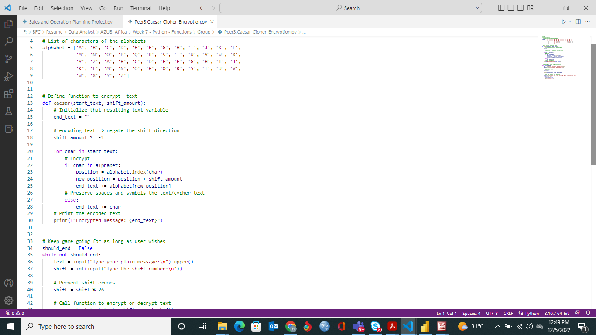
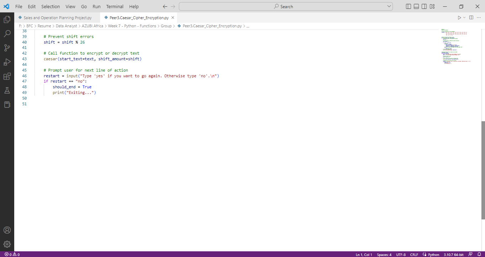
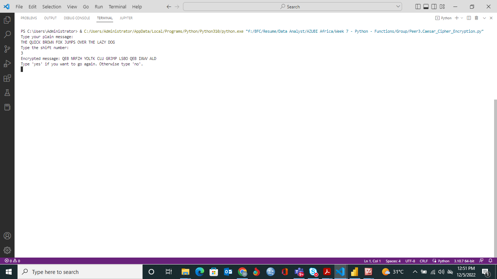

# Caesar-Cipher-Encryption

## Description
Caesar's cipher is an encryption technique that uses shift system for encryption

## :bulb:How It Works
:one: The code prompts you to type the plain text of your message 

:two: You will be prompted to add the shift number e.g. 3 

:three: The result of your encrypted message 

:four: The code prompts you again to type 'yes' if you want to enter a new message or 'no' to exit

## Screenshots :camera: of codes and results

&nbsp;

&nbsp;

## Author
Herbert DJANIE
